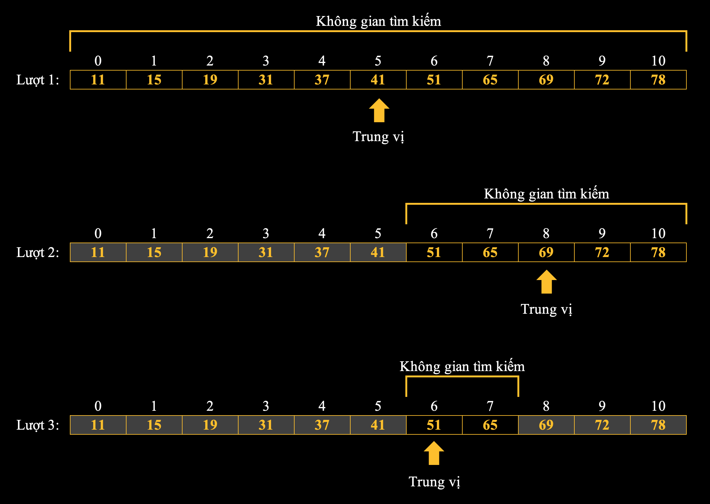
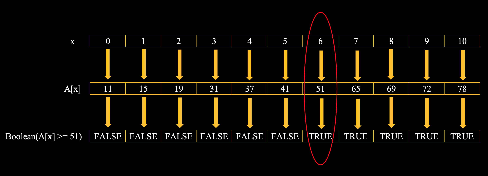

# Binary Search Algorithm

---

### Mục lục
- [Bài toán mở đầu](#1)
- [Tổng quát hóa bài toán](#2)
- [Độ phức tạp thuật toán](#3)
- [Tìm kiếm nhị phân trong thư viện chuẩn STL](#4)
- [Tìm kiếm nhị phân tổng quát](#5)
- [Cài đặt thuật toán tổng quát](#6)
- [Nguồn và tài liệu tham khảo](#7)

---

## Bài toán mở đầu {#1}

***Mô tả:***
Cho một dãy $A$ được sắp xếp tăng dần gồm các phần tử đôi một phân
biệt với nhau và một giá trị $x$ cho trước.

***Yêu cầu:***
Trả về vị trí của phần tử có giá trị $x$ trong dãy $A$.

***Ví dụ:***
Ta xét mảng $A = [11, 15, 19, 31, 37, 41, 51, 65, 69, 72, 78]$ và $x = 51$, thuật toán sẽ diễn ra như hình mô tả bên dưới.



**Cụ thể:**

- Ở lượt đầu tiên, **không gian tìm kiếm** là tập $S = [0, 1, 2, \dots, 10]$. Ta chọn **phần tử trung vị** ở vị trí $5$ có giá trị $A[5] = 41$. So sánh $A[5] = 41 < 51 = x$. Do dãy $A$ đã được sắp xếp tăng dần, nên các phần tử $A[0], A[1], \dots, A[5]$ đều bé hơn $x = 51$. Vậy ta có thể bỏ đi các phần tử đó và giảm **không gian tìm kiếm** đi một nửa. Ta được **không gian tìm kiếm** mới: $S = [6, 7, 8, 9, 10]$.
- Ở lượt thứ hai, **không gian tìm kiếm** là tập $S = [6, 7, 8, 9, 10]$. Ta chọn **phần tử trung vị** ở vị trí $8$ có giá trị $A[8] = 69$. So sánh $A[8] = 69 > 51 = x$. Do dãy $A$ đã được sắp xếp tăng dần, nên các phần tử $A[8], A[9], A[10]$ đều lớn hơn $x = 51$. Vậy ta có thể bỏ đi các phần tử đó và giảm **không gian tìm kiếm** đi một nửa. Ta được **không gian tìm kiếm** mới: $S = [6, 7]$.
- Ở lượt thứ ba, **không gian tìm kiếm** có số lượng phần tử chẵn nên có hai phần tử trung vị, ta giả sử chọn phần tử trung vị đầu tiên. Ta so sánh $A[6] = 51 = x$. Lúc này ta đã xác định được kết quả bài toán: $6$ là vị trí của phần tử có giá trị $51$ trong dãy. Lúc này thuật toán dừng lại.

## Tổng quát hóa bài toán {#2}

Từ ví dụ trên, ta đã mô hình hóa được ý tưởng của thuật toán tìm kiếm nhị phân. Thuật toán sẽ liên tục chia không gian tìm kiếm thành hai nửa và loại bỏ một nửa đi. Về cơ bản, có thể hiểu như sau:

1. Ta duy trì một không gian tìm kiếm $S$ là một dãy con các giá trị **có thể là kết quả** của bài toán cần tìm. Ở trong bài toán mở đầu, vì ta cần tìm chỉ số (hay vị trí) của một phần tử có giá trị $x$ nên ban đầu, mọi chỉ số đều có thể là kết quả của bài toán. Do đó ta xác định được tập $S = [0, 10]$.
2. Ở mỗi bước, thuật toán so sánh giá trị cần tìm với giá trị của phần tử trung vị của không gian tìm kiếm. Dựa trên so sánh đó, kết hợp với giả thiết dãy $A$ cho trước có tính thứ tự, cụ thể là tăng dần, ta có thể suy ra được những phần tử nào **chắc chắn không thể là kết quả** bài toán và loại bỏ chúng. Lặp lại quá trình này đến khi không gian tìm kiếm chỉ còn $1$ phần tử.
3. Khi đó, nếu giá trị duy nhất này bằng với giá trị $x$ cần tìm thì đó là nghiệm của bài toán. Ngược lại bài toán sẽ vô nghiệm.

***Lưu ý:***

- Trong thực tế khi code thì ta sẽ không lưu trữ không gian tìm kiếm $S$ mà ta chỉ sử dụng hai biến $left$ và $right$ tượng trưng cho phần tử đầu tiên (phần tử bên trái ngoài cùng) và phần tử cuối cùng (phần tử bên phải ngoài cùng).
- Ta có thể tối ưu thuật toán bằng việc ***dừng sớm*** nếu trong quá trình so sánh gặp một phần tử trung vị thỏa mãn yêu cầu đề bài chứ không cần đợi đến khi không gian tìm kiếm chỉ còn một phần tử.

***Code mẫu dùng C++***

```c++
//  Dãy A được lưu trữ trong vector a gồm các phần tử kiểu số nguyên và giá trị cần tìm x = value.
int binary_search(vector <int> a, int value) {
    int left = 0, right = (int)a.size() - 1;

    while (left <= right) {
        int mid = left + (right - left) / 2;
        if (a[mid] == value)
            return mid;
        else if (a[mid] < value)
            left = mid + 1;
        else
            right = mid - 1;
    }

    return -1;  // không tìm thấy giá trị value trong dãy A
}
```

## Độ phức tạp thuật toán {#3}

Ở mỗi bước, không gian tìm kiếm bị giảm đi một nửa. Ta dễ thấy độ phức tạp thời gian của thuật toán là $O(\log(N))$ với $N$ là số phần tử ban đầu của không gian tìm kiếm.

## Tìm kiếm nhị phân trong thư viện chuẩn STL {#4}

C++ Standard Template Library đã cài đặt sẵn thuật toán tìm kiếm nhị phân bằng các hàm:

1. `lower_bound()`.
2. `upper_bound()`.
3. `binary_search()`.
4. `equal_range()`.

Cụ thể bạn có thể tìm đọc ở các bài viết riêng giới thiệu về các hàm đó.

## Tìm kiếm nhị phân tổng quát {#5}

Phần trên là một trường hợp đơn giản của thuật toán tìm kiếm nhị phân. Mục tiêu của ta ở phần này sẽ tổng quát hóa thuật toán tìm kiếm nhị phân cho một lớp các bài toán rộng hơn. Ta sẽ thấy thuật toán tìm kiếm nhị phân có thể mở rộng để áp dụng cho ***bất kỳ loại hàm số đơn điệu nào nhận tham số đầu vào là một số nguyên***. 

### Cơ sở lý thuyết

Cho không gian tìm kiếm $S$ là tập các nghiệm có thể của bài toán. Ta định nghĩa một hàm kiểm tra $P$ là một hàm nhận một nghiệm $x \in S$ và trả về giá trị $true$ hoặc $false$ cho biết $x$ có ***hợp lệ*** hay không.

**Lưu ý:** tùy từng bài toán mà ta có cách định nghĩa từ ***hợp lệ*** khác nhau.


> Ta thay đổi bài toán mở đầu thành bài toán mới như sau: ***Tìm chỉ số nhỏ nhất sao cho phần tử ở chỉ số đó lớn hơn hoặc bằng $x$.*** Tập $S = [0, 1, 2, \dots, 10]$ là tập các nghiệm có thể của bài toán. Ta có: $P(x) = true \; \forall x \in S \; \vert \; A[x] \ge 51$ và $P(x) = false \; \forall x \in S \; \vert \; A[x] < 51$ (có thể xem hình mô tả ở dưới để hiểu rõ hơn).

### Định lý chính

Một bài toán chỉ có thể áp dụng thuật toán tìm kiếm nhị phân nếu và chỉ nếu hàm kiểm tra $P$ của bài toán thỏa mãn:

$$\forall x, y \in S, y > x \wedge P(x) = true \Rightarrow P(y) = true$$

Tính chất trên của hàm kiểm tra $P$ cũng tương đương với tính chất sau:

$$\forall x, y \in S, y < x \wedge P(x) = false \Rightarrow P(y) = false$$

Định lý trên cho ta **điều kiện cần và đủ** để một bài toán có thể giải bằng thuật toán tìm kiếm nhị phân. Ý nghĩa tính chất của hàm $P$ có thể được hiểu như sau:

- Tính chất $1$: Nếu $x$ hợp lệ thì mọi phần tử $y > x$ đều hợp lệ. Tính chất này giúp ta loại bỏ đi nửa sau của không gian tìm kiếm do đã biết chắc $x$ là phần tử nhỏ nhất trong nửa sau không hợp lệ. Ở đây, ta sẽ ghi nhận $x$ là kết quả tạm thời và tiếp tục tìm xem có phần tử nào ở nửa đầu (nhỏ hơn $x$) hợp lệ hay không.
- Tính chất $2$: Nếu $x$ không hợp lệ thì mọi phần tử $y < x$ đều không hợp lệ. Tính chất này giúp chúng ta loại đi nửa trước của không gian tìm kiếm do đã biết chắc chắn chúng không hợp lệ. Ta chỉ cần quan tâm đến những phần tử ở nửa sau (lớn hơn $x$) mà ta chưa biết thông tin chúng có hợp lệ hay không.

Nếu ta tính giá trị $P(x)$ cho từng phần tử trong $S$ ban đầu, ta sẽ được một dãy liên tiếp các giá trị $false$ liền kề một dãy liên tiếp các giá trị $true$ (tạm gọi dãy $P(S)$). Dễ thấy, ta có thể áp dụng tìm kiếm nhị phân trên dãy $P(S)$ mới này để tìm giá trị $x$ nhỏ nhất thỏa mãn $P(x) = true$ (hoặc ngược lại ta cũng có thể tìm giá trị $x$ lớn nhất mà $P(x) = false$, tuy nhiên ở đây ta sẽ không làm theo cách này).

> Với bài toán mới, ta có: $P(x) = boolean(A[x] \ge 51)$. Dễ thấy, $P$ thỏa mãn tính chất đầu tiên. Vì dãy $A$ được sắp xếp tăng dần nên nếu $A[x] \ge 51$ thì chắc chắn các phần tử $y > x$ đều thỏa $A[y] \ge A[x] \ge 51$. Tương tự, ta cũng suy ra được nếu $A[x] < 51$ thì chắc chắn các phần tử $y < x$ đều thỏa $A[y] \le A[x] \le 51$. Áp dụng hàm $P(x) = boolean(A[x] \ge 51)$ cho từng phần tử của $S = [0, 1, 2, \dots, 10]$ ta có hình dưới đây:



**Chú ý:** Ta cũng có thể xây dựng hàm $P$ ngược lại theo cách tương tự.

Từ định lý trên, mấu chốt để giải một bài toán áp dụng thuật toán tìm kiếm nhị phân là **thiết kế được hàm $P$ hợp lý sao cho thỏa mãn điều kiện trong định lý chính.**

## Cài đặt thuật toán tổng quát {#6}

Để cài đặt thuật toán ta cần chú ý những vấn đề sau:
1. Thiết kế được dãy $P(S)$ có dạng $false - true$ ($false$ liên tiếp rồi $true$ liên tiếp) hoặc ngược lại. Ở dưới dãy $P(S)$ được mặc định ở dạng $false - true$.
2. Xác định rõ tìm phần tử $false$ lớn nhất hay $true$ nhỏ nhất.
3. Bài toán phải luôn đảm bảo có nghiệm.
4. Nếu bài toán luôn luôn có nghiệm, phải đảm bảo giá trị chặn dưới và chặn trên là bắt đầu và kết thúc của một khoảng đóng chứa kết quả cần tìm. Luôn đảm bảo điều kiện này trong lúc thu hẹp không gian tìm kiếm để tránh xảy ra lỗi.
5. Đảm bảo không gian tìm kiếm đủ rộng để xác định đúng kết quả.
6. Luôn kiểm tra trường hợp $P(S) = [false, true]$. Để hiểu lí do hãy đọc đến trường hợp $2$ của cài đặt.

***Trường hợp thứ nhất:*** tìm $x$ nhỏ nhất mà $P(S) = true$. Dưới đây là code mẫu viết bằng C++.

```c++
bool P(int x) {
    //  Logic of P stay here.
}

int binary_search(int left, int right) {
    while (left < right) {
        int mid = left + (right - left) / 2;
        if (P(mid) == true)
            right = mid;
        else
            left = mid + 1;
    }

    if (P(left) == false)
        return -1; // P(x) = false for all x in S -> answer is not exist.

    return left; // left is the minimum x that P(x) = true
}
```

Khi $P(mid) = true$, ta có thể bỏ nửa sau của không gian tìm kiếm vì đã biết phần tử trong đó luôn hợp lệ. Tuy nhiên ta vẫn phải giữ $mid$ trong không gian tìm kiếm mới vì nó có thể là phần tử đầu tiên mà $P = true$. Do đó không gian tìm kiếm mới sẽ là $S = [left, mid]$.

Tương tự, khi $P(mid) = false$, ta có thể bỏ nửa đầu (bao gồm cả phần tử $mid$) vì tất cả các phần tử này đều không hợp lệ. Lúc này không gian tìm kiếm mới sẽ là $S = [mid + 1, right]$.

***Trường hợp thứ hai:*** Tìm $x$ lớn nhất mà $P(x) = false$, suy luận tương tự như trên, ta có đoạn code sau:

```c++
bool P(int x) {
    //  Logic of P stay here.
}

int binary_search(int left, int right) {
    while (left < right) {
        int mid = left + (right - left + 1) / 2;
        if (P(mid) == true)
            right = mid - 1;
        else
            left = mid;
    }

    if (P(left) == true)
        return -1; // P(x) = true for all x in S -> answer is not exist.

    return left; // left is the minimum x that P(x) = false
}
```

Trong quá trình tìm kiếm, nếu tại một thời điểm nào đó mà dãy $P(S)$ tạo ra bởi các phần tử của không gian tìm kiếm dạng như sau:
$$[false, true]$$
Nếu ta tính $mid = left + \dfrac{1}{2}(right - left)$ thì đoạn code sẽ lặp vô hạn. Nó sẽ luôn chọn phần tử trung vị là $mid = left$, nhưng cận dưới $left$ sẽ không di chuyển vì nó muốn giữ lại phần tử có $p = false$ thỏa yêu cầu tìm kiếm đó. Do đó, ta thay đổi công thức tình $mid$ thành $mid = left + \dfrac{1}{2}(right - left + 1)$, làm như vậy sẽ khiến cận dưới sẽ được làm tròn lên thay vì làm tròn xuống, khi đó nó có thể loại bỏ phần tử $true$ trước khi xét phần tử $false$.

Nếu bạn thắc mắc vì sao ta tính $mid = left + \dfrac{1}{2}(right - left)$ thay vì $mid = \dfrac{1}{2}(right + left)$. Ta làm vậy là để tránh khả năng xảy ra lỗi làm tròn số nguyên, ta muốn phép chia được làm tròn xuống, về gần với cận dưới, tuy nhiên phép chia làm tròn khác khi có số âm, nên nếu $(left + right)$ là số am thì kết quả sẽ bị làm tròn lên.

## Nguồn và tài liệu tham khảo {#7}

1. [Nguồn: Binary Search Algorithm | VNOI](https://vnoi.info/wiki/algo/basic/binary-search.md#mjx-eqn-eq%3A2).
2. [Binary Search | Topcoder](https://www.topcoder.com/thrive/articles/Binary%20Search).
